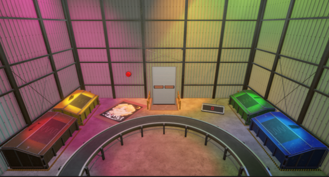

# TriColor

## Quick presentation
GameJam at ISART Digital, 1 week to create a game with the theme "10 billions customer".

## Team

- [@Angel](https://github.com/Angel-2180) - Game Programmer *(2nd Year)*
- [@Hezaerd](https://github.com/Hezaerd) - Game Programmer *(2nd Year)*
- [@Raftatul](https://raftatul.github.io/#Projects) - Game Designer *(2nd Year)*
- [@Clement](https://www.linkedin.com/in/clément-regazzoni-1a7a581bb/) - Game Artist *(2nd Year)*
- [@Kenzo](https://www.linkedin.com/in/kenzo-penet-194a1122a/) - Game Artist *(3rd Year)*
- [@Basile](https://www.linkedin.com/in/basile-strang-9b8470229/) - Game Designer *(3rd Year)*
- [@Joshua](https://www.linkedin.com/in/joshua-grange-96b341208/) - Game Designer *(3rd Year)*

## Installation

- open the project with Unity 2019.4.1f1

## GamePlay
- You are a garbage collector that have to collect all the garbage.
- To do so you'll have to put the right garbage in the right bin by dragging it with your mouse.
- You'll have to be fast because the garbage will be coming faster and faster.
- There is some ***unwanted*** garbage that you'll have to deal with so be careful about unexpected event.

    

